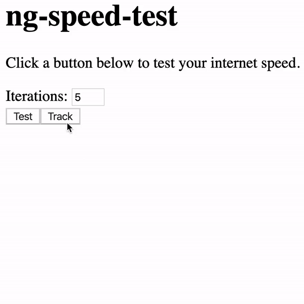

# ng-speed-test

[](https://www.npmjs.com/package/ng-speed-test)
[](https://www.npmjs.com/package/ng-speed-test/)
[](https://www.npmjs.com/package/ng-speed-test)
[](https://www.npmjs.com/package/ng-speed-test)
[](https://angular.io/)

A modern, lightweight Angular library for testing internet connection speed with built-in network monitoring.

🚀 **[Try the Live Demo](https://ng-speed-test.jrquick.com)**



## ✨ Features

- 🎯 **Accurate Speed Testing** - Uses multiple iterations for reliable results
- 🔄 **Network Status Monitoring** - Real-time online/offline detection
- ⚡ **Modern Fetch API** - Better performance and error handling
- 🎨 **TypeScript Support** - Full type definitions included
- 📱 **Mobile Friendly** - Works on all devices and browsers
- 🔧 **Highly Configurable** - Customize file sizes, iterations, and retry logic
- 🆕 **Angular 16-20 Compatible** - Works with latest Angular versions

## 📋 Table of Contents

- [Installation](#-installation)
- [Quick Start](#-quick-start)
- [Configuration](#-configuration)
- [API Reference](#-api-reference)
- [Examples](#-examples)
- [Browser Support](#-browser-support)
- [Contributing](#-contributing)

## 🚀 Installation

Requires Node.js `^20.19.0 || ^22.12.0 || >=24.0.0` (the Angular CLI toolchain used to build this package enforces
this range). An older Node, such as `20.5.x`, will pass `npm install` but fail on `ng build`/`ng serve`/etc. with
the CLI's own version-check error — this project's `engines` field and `.nvmrc` will additionally surface an
`EBADENGINE` warning during install so the mismatch isn't a surprise.

```bash
npm install ng-speed-test --save
```

## ⚡ Quick Start

### 1. Import the Module

Add `SpeedTestModule` to your app module:

```typescript
import { SpeedTestModule } from 'ng-speed-test';

@NgModule({
  imports: [
    SpeedTestModule
  ],
})
export class AppModule { }
```

### 2. Inject the Service

```typescript
import { Component } from '@angular/core';
import { SpeedTestService } from 'ng-speed-test';

@Component({
  selector: 'app-speed-test',
  template: `
    <div>
      <button (click)="runSpeedTest()" [disabled]="isLoading">
        {{ isLoading ? 'Testing...' : 'Test Speed' }}
      </button>
      <div *ngIf="speedResult">
        Your speed: {{ speedResult.mbps | number:'1.2-2' }} Mbps
      </div>
    </div>
  `
})
export class SpeedTestComponent {
  isLoading = false;
  speedResult: any;

  constructor(private speedTestService: SpeedTestService) {}

  runSpeedTest() {
    this.isLoading = true;
    
    this.speedTestService.getSpeedTestResult().subscribe({
      next: (result) => {
        this.speedResult = result;
        this.isLoading = false;
      },
      error: (error) => {
        console.error('Speed test failed:', error);
        this.isLoading = false;
      }
    });
  }
}
```

## 🛠️ Configuration

### Basic Configuration

```typescript
const customSettings = {
  iterations: 5,           // Run 5 tests for better accuracy
  retryDelay: 1000,       // Wait 1 second between retries
  file: {
    path: 'https://example.com/test-file.jpg',
    size: 1048576,        // 1MB in bytes
    shouldBustCache: true // Prevent browser caching
  }
};

this.speedTestService.getMbps(customSettings).subscribe(speed => {
  console.log(`Speed: ${speed} Mbps`);
});
```

### Global Configuration

`provideSpeedTest()` sets defaults for every call in your app - the connectivity pre-flight check
URL, the default test file, and timeouts. It's optional; every field already has a working default.

```typescript
import { ApplicationConfig } from '@angular/core';
import { provideSpeedTest } from 'ng-speed-test';

export const appConfig: ApplicationConfig = {
  providers: [
    provideSpeedTest({
      // Opt-in only: by default ng-speed-test does not contact any third-party host to verify
      // connectivity - it trusts navigator.onLine, and an unreachable network still surfaces as
      // a real error from the file fetch itself. Set this if you want an extra, network-verified
      // check (e.g. against your own backend) before every speed test.
      connectivityCheckUrl: 'https://your-api.example.com/ping',
      connectivityCheckTimeout: 3000, // ms, defaults to 3000
      file: {
        path: 'https://your-cdn.example.com/test-file.bin',
        size: 5_000_000
      },
      timeout: 15000 // ms, defaults to 15000
    })
  ]
};
```

> **Note on the pre-4.x default:** earlier versions hardcoded `https://httpbin.org/get?minimal=true`
> as the connectivity check, run on every speed test with no opt-out - an outage or rate limit on
> that third-party host made every consumer's app report itself offline (see
> [issue #108](https://github.com/jrquick17/ng-speed-test/issues/108)). `provideSpeedTest()` fixes
> this: no third-party host is contacted unless you configure one.

If you're using `SpeedTestModule` and `NgModule`-based bootstrapping instead, pass the same
providers array to your root module's `providers` instead of `ApplicationConfig`.

### Available Test Files

Pre-configured test files hosted on GitHub:

| Size | Actual Size (bytes) | URL |
|------|-------------------|-----|
| 500KB | 408,949 | `https://raw.githubusercontent.com/jrquick17/ng-speed-test/.../500kb.jpg` |
| 1MB | 1,197,292 | `https://raw.githubusercontent.com/jrquick17/ng-speed-test/.../1mb.jpg` |
| **5MB** | 4,952,221 | `https://raw.githubusercontent.com/jrquick17/ng-speed-test/.../5mb.jpg` *(default)* |
| 13MB | 13,848,150 | `https://raw.githubusercontent.com/jrquick17/ng-speed-test/.../13mb.jpg` |

## 📚 API Reference

### Core Methods

#### `getSpeedTestResult(settings?)`
Returns comprehensive speed test results with duration info.

```typescript
this.speedTestService.getSpeedTestResult().subscribe(result => {
  console.log('Speed:', result.mbps, 'Mbps');
  console.log('Duration:', result.duration, 'seconds');
  console.log('Bits per second:', result.bps);
  console.log('Kilobits per second:', result.kbps);
});
```

#### `getMbps(settings?)`
Get speed in megabits per second.

```typescript
this.speedTestService.getMbps().subscribe(speed => {
  console.log('Speed:', speed, 'Mbps');
});
```

#### `getKbps(settings?)`
Get speed in kilobits per second.

```typescript
this.speedTestService.getKbps().subscribe(speed => {
  console.log('Speed:', speed, 'Kbps');
});
```

#### `getBps(settings?)`
Get speed in bits per second.

```typescript
this.speedTestService.getBps().subscribe(speed => {
  console.log('Speed:', speed, 'bps');
});
```

### Network Monitoring

#### `isOnline()`
Check network connectivity.

```typescript
this.speedTestService.isOnline().subscribe(isOnline => {
  if (!isOnline) {
    console.log('No internet connection');
  }
});
```

#### `getNetworkStatus()`
Get detailed network information (when available).

```typescript
this.speedTestService.getNetworkStatus().subscribe(status => {
  console.log('Online:', status.isOnline);
  console.log('Connection type:', status.effectiveType); // '4g', 'wifi', etc.
  console.log('Downlink speed:', status.downlink); // Estimated speed
});
```

### Configuration Options

| Option | Type | Default | Description |
|--------|------|---------|-------------|
| `iterations` | number | 3 | Number of tests to run for averaging |
| `retryDelay` | number | 500 | Milliseconds to wait between retries |
| `file.path` | string | GitHub 5MB image | URL of test file |
| `file.size` | number | 4,952,221 | File size in bytes |
| `file.shouldBustCache` | boolean | true | Add cache-busting parameter |

## 💡 Examples

### Advanced Speed Test with Progress

```typescript
import { Component } from '@angular/core';
import { SpeedTestService } from 'ng-speed-test';

@Component({
  template: `
    <div class="speed-test">
      <h2>Internet Speed Test</h2>
      
      <!-- Network Status -->
      <div class="status" [class.online]="isOnline">
        Status: {{ isOnline ? 'Online' : 'Offline' }}
      </div>
      
      <!-- Test Controls -->
      <div class="controls">
        <select [(ngModel)]="selectedSize">
          <option value="500kb">500 KB Test</option>
          <option value="1mb">1 MB Test</option>
          <option value="5mb" selected>5 MB Test</option>
          <option value="13mb">13 MB Test</option>
        </select>
        
        <input type="number" [(ngModel)]="iterations" 
               min="1" max="10" placeholder="Iterations">
        
        <button (click)="runTest()" [disabled]="isRunning">
          {{ isRunning ? 'Testing...' : 'Start Test' }}
        </button>
      </div>
      
      <!-- Progress -->
      <div *ngIf="isRunning" class="progress">
        <div class="progress-bar">
          <div class="fill" [style.width.%]="progress"></div>
        </div>
        <p>{{ progressText }}</p>
      </div>
      
      <!-- Results -->
      <div *ngIf="lastResult" class="results">
        <h3>Results</h3>
        <div class="result-grid">
          <div class="result-item">
            <strong>{{ lastResult.mbps | number:'1.2-2' }}</strong>
            <span>Mbps</span>
          </div>
          <div class="result-item">
            <strong>{{ lastResult.kbps | number:'1.0-0' }}</strong>
            <span>Kbps</span>
          </div>
          <div class="result-item">
            <strong>{{ lastResult.duration | number:'1.2-2' }}</strong>
            <span>seconds</span>
          </div>
        </div>
      </div>
    </div>
  `,
  styles: [`
    .speed-test { max-width: 600px; margin: 0 auto; padding: 20px; }
    .status { padding: 10px; border-radius: 5px; margin-bottom: 20px; }
    .status.online { background: #d4edda; color: #155724; }
    .controls { display: flex; gap: 10px; margin-bottom: 20px; }
    .progress-bar { width: 100%; height: 8px; background: #e0e0e0; border-radius: 4px; }
    .fill { height: 100%; background: #007bff; transition: width 0.3s; }
    .result-grid { display: grid; grid-template-columns: repeat(3, 1fr); gap: 15px; }
    .result-item { text-align: center; padding: 15px; background: #f8f9fa; border-radius: 5px; }
  `]
})
export class AdvancedSpeedTestComponent {
  isOnline = true;
  isRunning = false;
  progress = 0;
  progressText = '';
  lastResult: any = null;
  selectedSize = '5mb';
  iterations = 3;

  private fileSizes = {
    '500kb': { size: 408949, path: 'https://raw.githubusercontent.com/.../500kb.jpg' },
    '1mb': { size: 1197292, path: 'https://raw.githubusercontent.com/.../1mb.jpg' },
    '5mb': { size: 4952221, path: 'https://raw.githubusercontent.com/.../5mb.jpg' },
    '13mb': { size: 13848150, path: 'https://raw.githubusercontent.com/.../13mb.jpg' }
  };

  constructor(private speedTestService: SpeedTestService) {
    // Monitor network status
    this.speedTestService.isOnline().subscribe(status => {
      this.isOnline = status;
    });
  }

  runTest() {
    if (!this.isOnline) return;

    this.isRunning = true;
    this.progress = 0;
    this.progressText = 'Initializing...';

    const fileConfig = this.fileSizes[this.selectedSize];
    const settings = {
      iterations: this.iterations,
      file: {
        path: fileConfig.path,
        size: fileConfig.size,
        shouldBustCache: true
      }
    };

    // Simulate progress
    const progressInterval = setInterval(() => {
      if (this.progress < 90) {
        this.progress += Math.random() * 10;
        this.progressText = `Testing... ${Math.floor(this.progress)}%`;
      }
    }, 200);

    this.speedTestService.getSpeedTestResult(settings).subscribe({
      next: (result) => {
        clearInterval(progressInterval);
        this.progress = 100;
        this.progressText = 'Complete!';
        this.lastResult = result;
        this.isRunning = false;
      },
      error: (error) => {
        clearInterval(progressInterval);
        console.error('Test failed:', error);
        this.isRunning = false;
      }
    });
  }
}
```

### Simple Network Monitor

```typescript
@Component({
  template: `
    <div [class]="networkStatus.isOnline ? 'online' : 'offline'">
      {{ networkStatus.isOnline ? 'Connected' : 'Disconnected' }}
      <span *ngIf="networkStatus.effectiveType">
        ({{ networkStatus.effectiveType }})
      </span>
    </div>
  `
})
export class NetworkMonitorComponent {
  networkStatus = { isOnline: true, effectiveType: null };

  constructor(private speedTestService: SpeedTestService) {
    this.speedTestService.getNetworkStatus().subscribe(status => {
      this.networkStatus = status;
    });
  }
}
```

## 🌐 Browser Support

- **Chrome** 60+
- **Firefox** 55+
- **Safari** 12+
- **Edge** 79+
- **Mobile browsers** with Fetch API support

## 🔧 Angular Compatibility

| ng-speed-test | Angular |
|---------------|---------|
| 3.x | 16, 17, 18, 19, 20 |
| 2.x | 12, 13, 14, 15 |
| 1.x | 8, 9, 10, 11 |

## 🐛 Troubleshooting

### Common Issues

**CORS Errors**
- Use the provided test files or ensure your custom files have proper CORS headers
- GitHub-hosted test files are CORS-enabled

**Inaccurate Results**
- Increase `iterations` for better accuracy (recommended: 5-10)
- Use appropriate file sizes (1-5MB for most connections)
- Ensure stable network during testing

**TypeScript Errors**
- Make sure you're importing from `'ng-speed-test'`
- Check that your Angular version is compatible

### Development Setup

```bash
# Clone the repository
git clone https://github.com/jrquick17/ng-speed-test.git

# Use the supported Node version (see .nvmrc)
nvm use

# Install dependencies
npm install

# Run the demo
npm run demo

# Build the library
npm run build

# Run tests
npm run test
```

## 📄 License

This project is licensed under the MIT License - see the [LICENSE](LICENSE) file for details.

## 🙏 Acknowledgments

- Created by [Jeremy Quick](https://jrquick.com)
- Inspired by the need for reliable network testing in Angular applications
- Thanks to all [contributors](https://github.com/jrquick17/ng-speed-test/graphs/contributors)

## 🔗 Links

- [Live Demo](https://ng-speed-test.jrquick.com)
- [GitHub Repository](https://github.com/jrquick17/ng-speed-test)
- [NPM Package](https://www.npmjs.com/package/ng-speed-test)
- [Issues & Support](https://github.com/jrquick17/ng-speed-test/issues)
- [Jeremy's Website](https://jrquick.com)

---

**Made with ❤️ for the Angular community**
