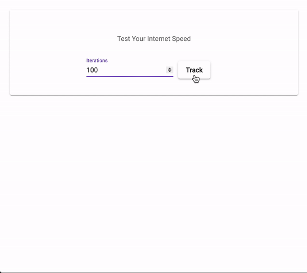

# ng-speed-test #

[](https://www.npmjs.com/package/ng-speed-test/)
[](https://www.npmjs.com/package/ng-speed-test)
[](https://www.npmjs.com/package/ng-speed-test)



## Index ##

* [About](#about)
* [Setup](#setup)
* [Documentation](#documentation)
* [Contributing](#contributing)
* [Issues](#issues)
* [Deploy](#deploy)

## About ## 

Simple Angular 2+ service for checking internet speed  

* Try out [the demo](https://ng-speed-test.jrquick.com) to see it in action!
* Visit [my website](https://jrquick.com) for other cool projects!

## Setup ##

### Install Node ###

```
npm install ng-speed-test --save
```

### Import module ###

* Import `SpeedTestModule` by adding the following to your parent module (i.e. `app.module.ts`):

    ```
    import { SpeedTestModule } from 'ng-speed-test';

    @NgModule({
      ...
      imports: [
        SpeedTestModule,
        ...
      ],
      ...
    })
    export class AppModule {}
    ```

### Use service ###

* Checkout the demo and it's code for more examples.

```typescript
import {SpeedTestService} from 'ng-speed-test/services/speed-test.service';

@Injectable()
export class TechCheckService {
  constructor(
    private speedTestService:SpeedTestService
  ) {
    this.speedTestService.getSpeed().subscribe(
      (speed) => {
        console.log('Your speed is ' + speed);
      }
    );
  }
```

## Documentation ##

### Events ###

* `autoFocus($event)` is fired when the input is focused.  
* `autoBlur($event)` is fired when the input is blured.  
* `ionAutoInput($event)` is fired when user inputs.  
* `itemChanged($event)` is fired when the selection changes (clicked).  
* `itemsHidden($event)` is fired when items are hidden.  
* `itemRemoved($event)` is fired when item is removed (clicked).  
* `itemSelected($event)` is fired when item is selected from suggestions (clicked).  
* `itemsShown($event)` is fired when items are shown.  

## Contributing ##

### Thanks ###

* [jrquick17](https://github.com/jrquick17)

## Issues ##

If you find any issues feel free to open a request in [the Issues tab](https://github.com/jrquick17/ng-speed-test/issues). If I have the time I will try to solve any issues but cannot make any guarantees. Feel free to contribute yourself.

## Deploy ##

### Demo ###
    
* Run `npm install` to get packages required for the demo and then run `ng serve` to run locally.

### Generate Docs ###

* Run `npm run docs:build`

#### Update Version ###
    
* Update version `package.json` files in both the root and `dist/` directory following [Semantic Versioning (2.0.0)](https://semver.org/).

### Build ###

* Run `npm run build` from root.

#### Test ####

* Copy `dist/` contents into `demo/node_modules/ng-speed-test/`
    * Run from root:  `cp -fr dist/* demo/node_modules/ng-speed-test/`
* Run `ng serve` from `demo/`
* Run `ng build --prod` from `demo/`

#### NPM Release ####

* Run `npm publish` from `dist/` directory.

#### Update Changelog ####

* Add updates to `CHANGELOG.md` in root.
